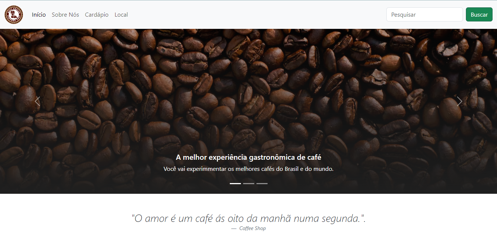

# Cafeteria - Site todo construido todo em Boostrap.

<a href='https://joserenatofelix.github.io/Cafeteria/'><button>Confira o projeto clicando aqui</button>

O projeto cafeteria foi criado com o objetivo de aprimorar nossos conhecimentos em CSS. Para isso, utilizamos o framework Bootstrap, uma ferramenta poderosa que nos permitiu criar um layout responsivo e moderno, capaz de se adaptar a diferentes tamanhos de tela e oferecer uma navegação intuitiva e fácil.

Além disso, no projeto cafeteria apresenta informações relevantes sobre o nosso estabelecimento, seus produtos e promoções, de modo que você possa conhecer mais sobre o que temos a oferecer. Acreditamos que um site bem estruturado e atrativo pode ser fundamental para o sucesso de um negócio, especialmente no mundo digital, e por isso dedicamos todo o nosso empenho e paixão na criação deste ambiente.

Site:

Estamos muito felizes em apresentar o o projeto cafeteria, um site criado com a técnica e dedicação necessárias para oferecer uma experiência completa e acessível. Aqui, você é nosso convidado(a) de honra, e esperamos que possa desfrutar de tudo o que temos a oferecer. Sinta-se à vontade para compartilhar conosco suas opiniões e sugestões, pois acreditamos que a interação com nossos clientes é fundamental para o sucesso de nossa marca.

Obrigado(a) por sua visita, e esperamos que o projeto cafeteria seja uma fonte de inspiração e conhecimento. Venha nos conhecer melhor e sinta o aroma e sabor dos nossos cafés, pois temos certeza de que você encontrará tudo o que precisa em nosso site!

